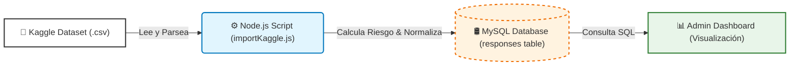

```mermaid
graph LR
    %% Nodos
    A["📄 Kaggle Dataset (.csv)"] 
    B("⚙️ Node.js Script (importKaggle.js)")
    C[("🛢️ MySQL Database (responses table)")]
    D["📊 Admin Dashboard (Visualización)"]

    %% Conexiones
    A -->|Lee y Parsea| B
    B -->|Calcula Riesgo & Normaliza| C
    C -->|Consulta SQL| D

    %% Estilos
    style A fill:#fff,stroke:#333,stroke-width:2px
    style B fill:#e1f5fe,stroke:#0277bd,stroke-width:2px
    style C fill:#fff3e0,stroke:#ef6c00,stroke-width:2px,stroke-dasharray: 5 5
    style D fill:#e8f5e9,stroke:#2e7d32,stroke-width:2px
```